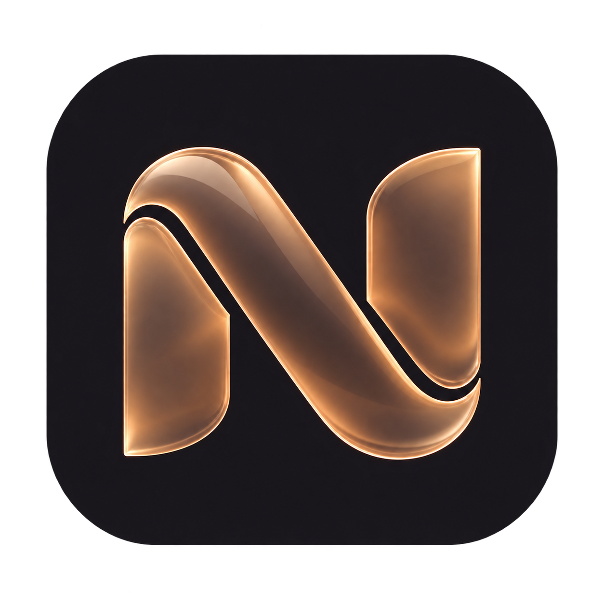
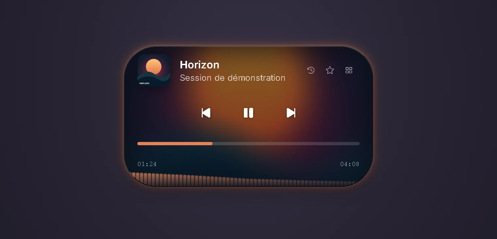
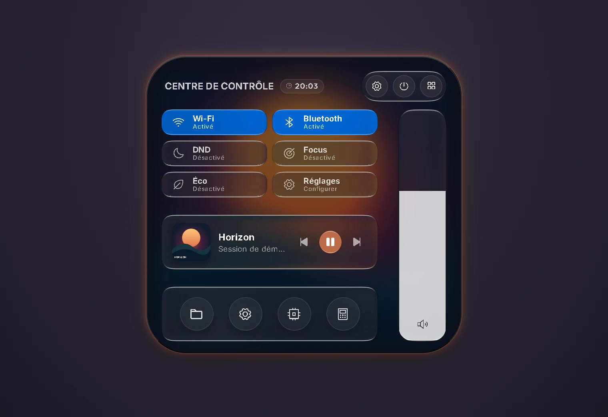
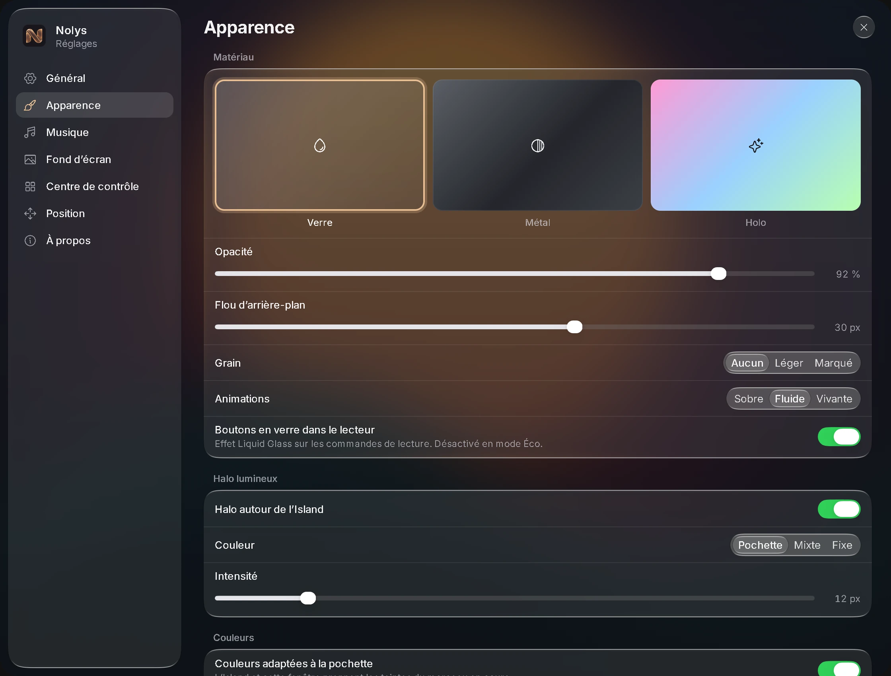
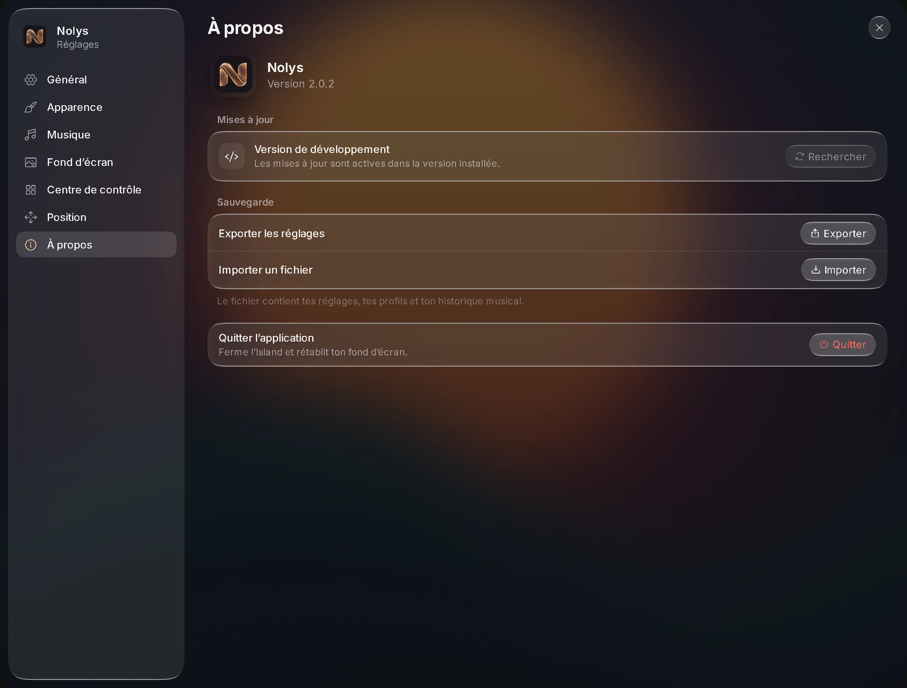

# Nolys

<p></p>

**Votre musique. Votre bureau. À portée de clic.**

Nolys est le nouveau nom de Liquid Dynamic Island. La version source **2.0.2** intègre l’identité Liquid Glass cuivre/champagne. La dernière version installable publiée est encore [Liquid Dynamic Island 2.0.1](https://github.com/NALYD2400/dynamique-island/releases/tag/v2.0.1).

Widget « Dynamic Island » pour Windows : musique (Spotify, navigateurs…), mixeur audio par application, centre de contrôle, notifications, synchronisation du fond d'écran.

Le cœur Tauri 2 / Rust remplace l’ancien assemblage Electron, .NET et PowerShell. La pilule est écrite en JavaScript/CSS ; les réglages utilisent React et Liquid Glass.

## Au quotidien

- Lecteur musical : suivi des sessions Windows, pochette, progression, volume et historique.
- Mixeur audio par application, périphériques de sortie et d’entrée.
- Centre de contrôle : commandes Windows, raccourcis, météo et mesures système.
- Chronomètre, notifications compactes, placement et taille sur plusieurs écrans.
- Matériaux, transparence, flou, halos et couleurs personnalisables ; synchronisation avec les pochettes et le fond d’écran.

## Identité

Le N en verre teinté cuivre est partagé par l’app, la barre système, l’installateur et le portfolio. Palette : cuivre `#D49460`, champagne `#EDBC89`, charbon `#17151B`, ivoire `#F5EFE7`. Les préférences enregistrées et les couleurs des pochettes restent prioritaires. [Sources et exports de la marque](branding/README.md).

Le dépôt GitHub et l’identifiant `com.nalyd.liquid-dynamic-island` sont conservés pour assurer la continuité des données et du canal de mise à jour.

## Aperçu de la nouvelle identité

Captures du code source 2.0.2, rendues avec un pont Tauri de démonstration. Musique, météo et données Windows sont simulées ; la matière, les contrôles et le logo viennent de l’interface réelle.

| Lecteur musical | Centre de contrôle |
|---|---|
|  |  |

| Apparence | À propos |
|---|---|
|  |  |

## Prérequis

- [Rust](https://rustup.rs) (stable, MSVC)
- Node.js 22.12+ ou 24 LTS (Vite et CLI Tauri)
- WebView2 (déjà présent sur Windows 10/11)

```bash
npm install
```

## Commandes

| Commande | Rôle |
|---|---|
| `npm run dev` | Lance l'app en développement (serveur Vite + rechargement à chaud) |
| `npm run build` | Compile l'interface et le cœur, puis génère l'installeur NSIS (`src-tauri/target/release/bundle/nsis/`) |

## Structure

```
src/                         Interface, construite par Vite (vite.config.js) dans dist/
├─ public/assets/            Logo, polices et icônes embarquées (aucun CDN)
├─ shared/
│  ├─ ipc.js                 Pont interface <-> Rust (canaux nommés -> commandes Tauri)
│  └─ window-drag.js         Déplacement des fenêtres sans bordure (-webkit-app-region)
├─ services/                 Visualiseur audio, sons, thème
├─ island/                   Fenêtre de l'Island (JavaScript sans framework, très léger)
│  ├─ main.js                Point d'entrée
│  ├─ hit-region.js          Zone survolable envoyée au cœur (clic traversant)
│  ├─ styles/                CSS découpé par écran (ordre fixé par index.css)
│  └─ dynamic-island/
│     ├─ DynamicIsland.js    Classe principale (état initial)
│     ├─ features/           Logique : lecture, volume, mixeur, thème…
│     ├─ views/              Rendu des écrans : repos, lecteur, centre de contrôle…
│     └─ helpers/            Fonctions utilitaires (couleurs, formats, pochettes)
└─ settings/                 Fenêtre des réglages (React + @glass-sdk/liquid-glass)
   ├─ App.jsx                Barre latérale, fond réfracté, navigation
   ├─ pages/                 Général, Apparence, Musique, Fond d'écran, Centre de contrôle, Position, À propos
   ├─ components/            Cartes, lignes et contrôles en verre
   └─ state/                 Lecture/écriture des réglages et envoi à l'Island

src-tauri/src/               Cœur natif (Rust)
├─ lib.rs                    Démarrage, plugins, enregistrement des commandes
├─ commands/                 Commandes appelées par l'interface
├─ island/                   Fenêtre de l'Island : position, premier plan, clic traversant, écrans
├─ media/                    Suivi du morceau en cours, pochettes de secours (Deezer / iTunes)
├─ wallpaper/                Synchronisation et rendu du fond d'écran (flou, cinématique)
├─ platform/                 Accès Windows : WASAPI, SMTC, radios, registre, icônes, réseau…
├─ migration.rs              Reprise des réglages de la version Electron
├─ settings_window.rs        Fenêtre des réglages (créée à la demande)
├─ tray.rs / shortcut.rs     Icône de notification, raccourci global (Alt+I)
└─ updater.rs                Mises à jour via les releases GitHub
```

## Publier une mise à jour

1. Aligner la version dans `package.json`, `package-lock.json`, `src-tauri/tauri.conf.json`, `src-tauri/Cargo.toml` et `src-tauri/Cargo.lock`.
2. Compiler en signant les fichiers de mise à jour (la clé privée est dans `keys/`, jamais dans git) :

   ```powershell
   $env:TAURI_SIGNING_PRIVATE_KEY = Get-Content keys\updater.key -Raw
   $env:TAURI_SIGNING_PRIVATE_KEY_PASSWORD = ""
   npm run build
   ```

3. Créer une release GitHub sur `NALYD2400/dynamique-island` (tag `vX.Y.Z`) et y joindre, depuis `src-tauri/target/release/bundle/nsis/` :
   - `Nolys_X.Y.Z_x64-setup.exe`
   - `Nolys_X.Y.Z_x64-setup.exe.sig`
   - un fichier `latest.json` (modèle ci-dessous)

```json
{
  "version": "X.Y.Z",
  "notes": "Nouveautés…",
  "pub_date": "2026-10-08T12:00:00Z",
  "platforms": {
    "windows-x86_64": {
      "signature": "<contenu du fichier .sig>",
      "url": "https://github.com/NALYD2400/dynamique-island/releases/download/vX.Y.Z/Nolys_X.Y.Z_x64-setup.exe"
    }
  }
}
```

Les applications installées détectent la mise à jour au démarrage (carte « Mise à jour » des réglages).

> ⚠️ Si la clé `keys/updater.key` est perdue, les versions déjà installées ne pourront plus se mettre à jour automatiquement. Garde-en une copie en lieu sûr.

## Données utilisateur

`%APPDATA%\com.nalyd.liquid-dynamic-island\` : position de l'Island, journal `liquid-core.log`, fichiers du fond d'écran.
Au premier lancement, la position, le fond d'écran d'origine et tous les réglages de l'ancienne version Electron sont repris automatiquement.
